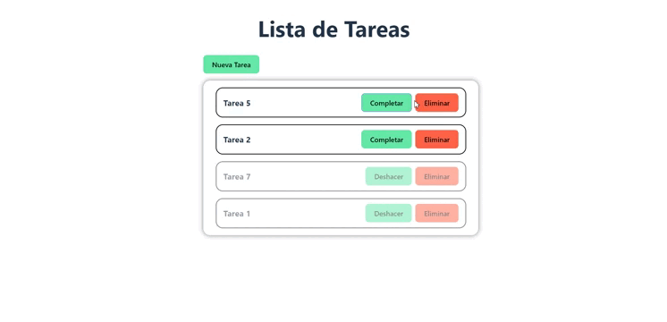

# Lista de Tareas

## Demo

<p
  align="center"
>
  
</p>

## Características

- [x] Listar tareas pendientes y completadas
- [x] Crear tarea
- [x] Eliminar tarea

## Instalación

**1.** Clonar el repositorio.

```bash
git clone https://github.com/gabriel-pantojab/proof-react.git
```

**2.** Ingresar a la carpeta del proyecto.

```bash
cd todo-list
```

**3.** Instalar las dependencias.

```bash
npm install
```

**4.** Ejecutar el proyecto.

```bash
npm run dev
```

## Tecnologías

- [React](https://es.reactjs.org/)
- [Vite](https://vitejs.dev/)
- [SweetAlert2](https://sweetalert2.github.io/)
